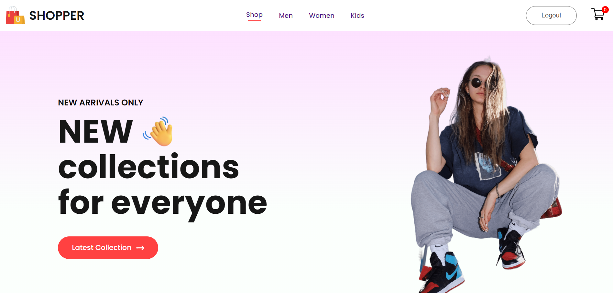
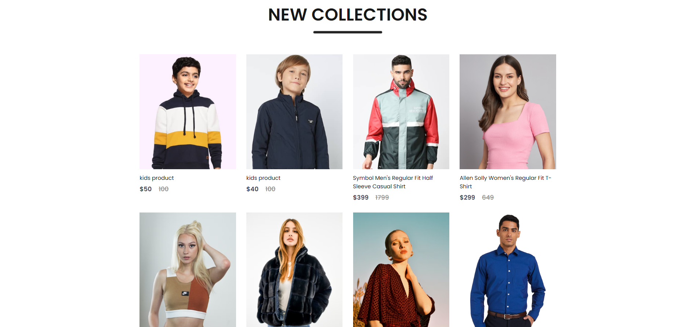
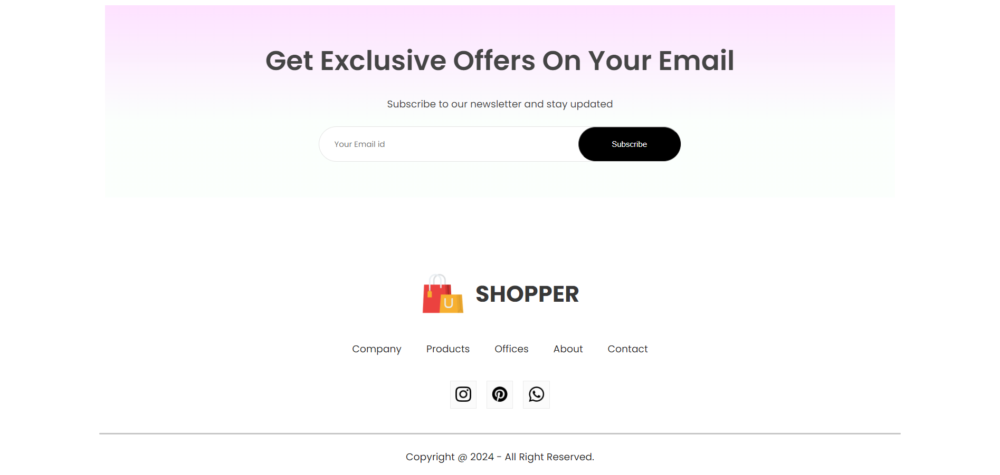

# eCommerce Website (MERN Stack)

Welcome to the eCommerce website project built with the MERN stack (MongoDB, Express.js, React, Node.js). This application allows users to browse products, manage their shopping cart, and place orders. It also includes an seperate admin panel for managing products and viewing orders.

## Features

- **User Authentication**: Register, log in, and manage user accounts.
- **Product Management**: Browse, search, and view products.
- **Shopping Cart**: Add, update, and remove items in the cart.
- **Admin Panel**: Manage products and view all orders.
- **Responsive Design**: Accessible on both desktop and mobile devices.
- **Image Storage**: To store images i have used multer package.

## Technologies Used

- **Frontend**: React, React Router, Axios
- **Backend**: Node.js, Express.js
- **Database**: MongoDB
- **Authentication**: JWT (JSON Web Tokens)
- **Styling**: CSS

## Demo






1. **Clone the Repository:**

   ```bash
   git clone [https://github.com/OnkarYevale07/Full-Stack-eCommerce-Website-MERN-Stack.git]
